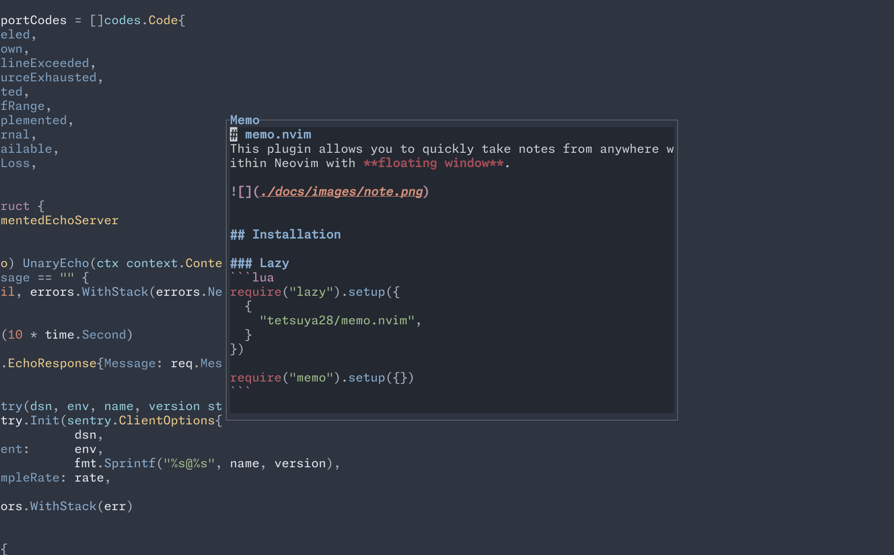
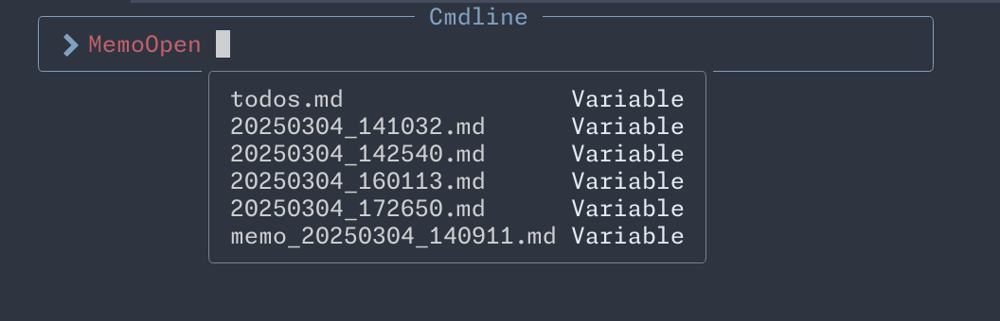

# memo.nvim
This plugin allows you to quickly take notes from anywhere within Neovim. Whether you're coding, reading documentation, or browsing files, you can instantly capture your thoughts without disrupting your workflow. With simple keybindings, you can open a note-taking buffer, save your notes, and access them later - all without leaving your editor.




## Installation

### Lazy
```lua
require("lazy").setup({
  {
    "tetsuya28/memo.nvim",
  }
})

require("memo").setup({})
```

## Settings
### Default settings
- Memo directory: `~/memos/`
  - Planning to make this configurable in future releases.

## Usage
- `:MemoNew` - Open memo ( default title is current datetime )
  - `:MemoNew <title>` - Open memo with title
- `:MemoOpen <title>` - Open memo with title

