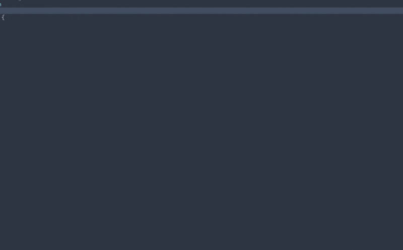
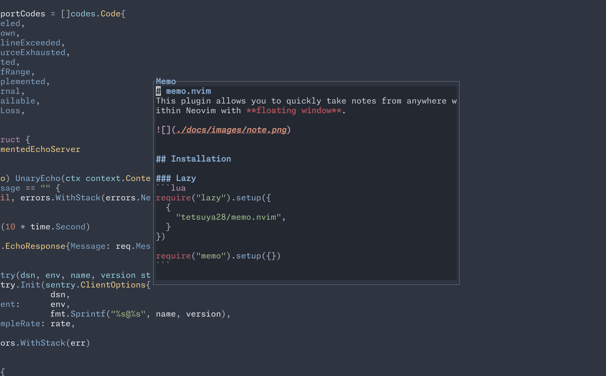
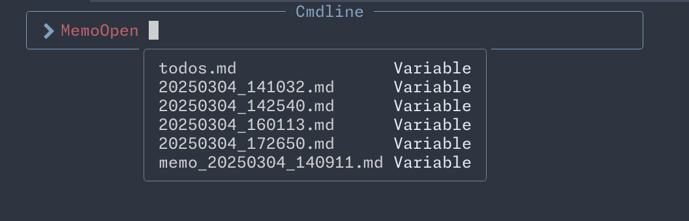

# memo.nvim
This plugin allows you to quickly take notes from anywhere within Neovim with **floating window**.



## Installation

### Lazy
```lua
require("lazy").setup({
    {
        "tetsuya28/memo.nvim",
    },
})

require("memo").setup({
    save_dir = vim.fn.expand("$HOME/memos"),
    width = 150,
    height = 50,
})
```

## Settings
### Default settings
- Memo directory: `~/memos/`
  - Planning to make this configurable in future releases.

## Usage
- `:MemoNew` - Open memo ( default title is current datetime )
  - `:MemoNew <title>` - Open memo with title


- `:MemoOpen <title>` - Open memo with title


## Options
| Key | Description | Default |
| --- | --- | --- |
| save_dir | Directory to save memo files | $HOME/memos |
| width | Width of memo window | 150 |
| height | Height of memo window | 50 |
